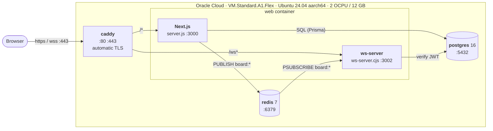
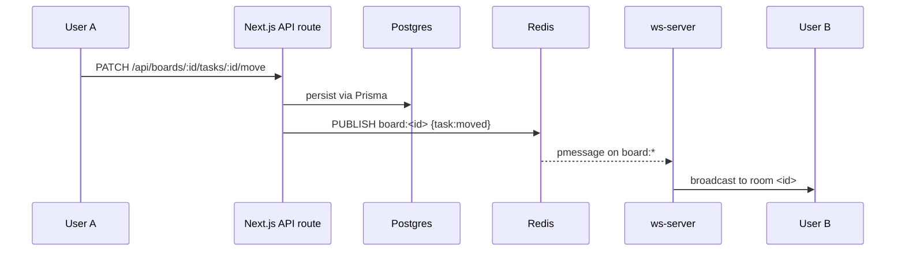
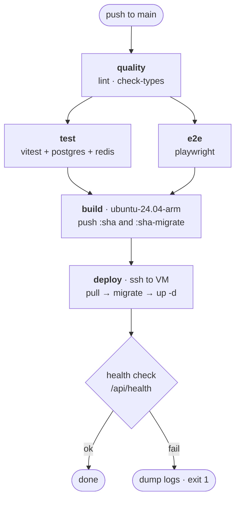

# 🌩️ Deployment Architecture

How Collboard runs in production: a single Oracle Cloud ARM VM running the
Docker Compose stack, fronted by Caddy, deployed from GitHub Actions.

- [Runtime topology](#runtime-topology)
- [Why one box](#why-one-box)
- [Request routing](#request-routing)
- [Real-time event flow](#real-time-event-flow)
- [Images and tags](#images-and-tags)
- [The deploy pipeline](#the-deploy-pipeline)
- [Host layout](#host-layout)
- [Configuration surface](#configuration-surface)
- [Operations](#operations)
- [Known constraints](#known-constraints)

---

## Runtime topology



Only Caddy binds host ports. Everything else communicates over the Compose
bridge network and is unreachable from the internet.

| Container                 | Image                                 | Host ports       | Purpose                                  |
| ------------------------- | ------------------------------------- | ---------------- | ---------------------------------------- |
| `collboard-caddy`         | `caddy:2-alpine`                      | 80, 443, 443/udp | TLS termination, path routing, HTTP/3    |
| `collboard-web`           | `ghcr.io/elx3020/collboard/web:<sha>` | —                | Next.js (3000) + WebSocket server (3002) |
| `collboard-postgres-prod` | `postgres:16-alpine`                  | —                | Application database                     |
| `collboard-redis-prod`    | `redis:7-alpine`                      | —                | Pub/sub bus for real-time events         |
| `collboard-migrate`       | `…/web:<sha>-migrate`                 | —                | One-off `prisma migrate deploy`, exits   |

---

## Why one box

The production image runs **two servers on two ports** — Next.js on 3000 and the
standalone WebSocket server on 3002, started together by
[`apps/web/entrypoint.sh`](apps/web/entrypoint.sh).

Most serverless container platforms (Cloud Run, Render, Railway, App Runner,
Azure Container Apps) expose exactly **one port per service**, which forces the
image to be split across two separately-deployed services with two hostnames.

A VM with a reverse proxy avoids that entirely. Caddy routes by path, so both
servers share one origin, one certificate, and one open port. As a bonus, the
Postgres and Redis containers stay on the private Compose network instead of
needing managed equivalents.

---

## Request routing

[`Caddyfile`](Caddyfile) is the whole routing table:

```caddyfile
{$DOMAIN} {
	encode zstd gzip

	handle /ws* {
		reverse_proxy web:3002
	}

	handle {
		reverse_proxy web:3000
	}
}
```

Caddy provisions and renews the Let's Encrypt certificate automatically on first
request for `$DOMAIN` — there is no certbot step and no renewal cron.

### WebSocket handshake

1. The client reads its NextAuth session token and opens
   `wss://<domain>/ws?token=<jwt>` — see
   [`websocket-provider.tsx`](apps/web/lib/websocket-provider.tsx).
2. Caddy detects the `Upgrade` header and proxies to `web:3002`, preserving the
   query string.
3. [`ws-server.ts`](apps/web/ws-server.ts)'s `upgrade` handler calls
   `verifyAuthToken`, which decodes the JWT and looks the user up via Prisma.
4. Invalid or missing token → `401` and the socket is destroyed. Valid → the
   connection is accepted and the client sends `join:board`.

The WS server ignores the request path, so `/ws` needs no prefix stripping.

### Same-origin socket URL

`NEXT_PUBLIC_WS_URL=/ws` is **baked into the client bundle at build time** —
Next.js inlines `NEXT_PUBLIC_*` during `next build`, so setting it at runtime has
no effect. It is declared as a build arg in
[`apps/web/Dockerfile`](apps/web/Dockerfile):

```dockerfile
ARG NEXT_PUBLIC_WS_URL=/ws
ENV NEXT_PUBLIC_WS_URL=$NEXT_PUBLIC_WS_URL
```

When unset, the provider falls back to `ws://<hostname>:3002`, which is what
local development and [`docker-compose.local.yml`](docker-compose.local.yml)
rely on.

---

## Real-time event flow

Redis is used **purely as a pub/sub bus** — no keys are cached or persisted.
It exists because the API routes and the WebSocket server are separate
processes that need to talk.



Channel helpers live in [`apps/web/lib/types.ts`](apps/web/lib/types.ts);
`publishEvent` and the subscriber connections live in
[`apps/web/lib/redis.ts`](apps/web/lib/redis.ts).

---

## Images and tags

Both images are built from the same [`Dockerfile`](apps/web/Dockerfile), from
different stages, and pushed to GitHub Container Registry.

| Tag                                           | Stage     | Size  | Used by           |
| --------------------------------------------- | --------- | ----- | ----------------- |
| `ghcr.io/elx3020/collboard/web:<sha>`         | `runner`  | small | `web` service     |
| `ghcr.io/elx3020/collboard/web:<sha>-migrate` | `builder` | large | `migrate` service |
| `ghcr.io/elx3020/collboard/web:latest`        | `runner`  | small | convenience only  |

The `runner` stage contains the Next.js standalone output, the esbuild-bundled
`ws-server.cjs`, and the generated Prisma Client — but **not** the Prisma CLI.
Migrations therefore run from the `builder` stage, which has the full workspace
`node_modules`. Publishing it as a separate tag means the VM pulls it instead of
rebuilding, which would otherwise mean a full Next.js build on the box on every
deploy.

> **Images are `linux/arm64` only.** They target the Ampere A1 VM. On an x86
> workstation, build locally with `docker-compose.local.yml` rather than pulling.

---

## The deploy pipeline

[`.github/workflows/ci-cd.yml`](.github/workflows/ci-cd.yml):



The `build` job runs on **`ubuntu-24.04-arm`**, which is free for public
repositories. Building arm64 natively rather than under QEMU emulation takes a
Next.js build from roughly 25 minutes to roughly 3.

The `deploy` job is gated behind the `production` GitHub Environment, so it can
require manual approval.

### Required repository secrets

| Secret           | Value                                                           |
| ---------------- | --------------------------------------------------------------- |
| `DEPLOY_HOST`    | VM public IPv4 address                                          |
| `DEPLOY_USER`    | `ubuntu`                                                        |
| `DEPLOY_SSH_KEY` | Private key, **without a passphrase** — Actions cannot type one |

---

## Host layout

```
/opt/collboard/
├── docker-compose.prod.yml   # scp'd from the repo on every deploy
├── Caddyfile                 # scp'd from the repo on every deploy
├── .env                      # secrets — never committed, chmod 600
├── backup.sh                 # nightly pg_dump
└── backups/                  # rotated 14 days
```

Named Docker volumes hold all state:

| Volume         | Contents                            | Recreatable?                                                               |
| -------------- | ----------------------------------- | -------------------------------------------------------------------------- |
| `pgdata`       | Postgres data directory             | **No — back this up**                                                      |
| `redisdata`    | Redis AOF                           | Yes, pub/sub only                                                          |
| `caddy_data`   | TLS certificates + ACME account key | Technically, but re-issuing hits Let's Encrypt rate limits (5/domain/week) |
| `caddy_config` | Caddy autosave config               | Yes                                                                        |

### Network path

Two independent firewalls must both allow traffic:

1. **OCI VCN security list** — ingress rules for TCP 22, 80, 443.
2. **Instance `iptables`** — Oracle's Ubuntu images ship with
   `iptables-persistent` and a `REJECT` rule in the `INPUT` chain. Rules must be
   _inserted_ above it (`iptables -I`, not `-A`) and saved with
   `netfilter-persistent save`.

---

## Configuration surface

Everything is driven by `/opt/collboard/.env`. Nothing sensitive lives in the
repo or the image — [`.dockerignore`](.dockerignore) excludes `.env*`.

| Variable                       | Example                   | Notes                                |
| ------------------------------ | ------------------------- | ------------------------------------ |
| `GHCR_IMAGE`                   | `elx3020/collboard/web`   | Registry path without host or tag    |
| `IMAGE_TAG`                    | `a1b2c3d`                 | Rewritten by the deploy job each run |
| `DOMAIN`                       | `collboard.example.com`   | Drives both Caddy and `NEXTAUTH_URL` |
| `DB_PASSWORD`                  | `openssl rand -base64 24` | Postgres superuser password          |
| `NEXTAUTH_SECRET`              | `openssl rand -base64 32` | JWT signing key                      |
| `GITHUB_CLIENT_ID` / `_SECRET` |                           | OAuth app credentials                |
| `GOOGLE_CLIENT_ID` / `_SECRET` |                           | OAuth client credentials             |

`DATABASE_URL`, `REDIS_URL` and `NEXTAUTH_URL` are **composed** from the above
inside [`docker-compose.prod.yml`](docker-compose.prod.yml) rather than set
directly.

OAuth callback URLs must be registered as
`https://<DOMAIN>/api/auth/callback/{github,google}`.

---

## Operations

```bash
cd /opt/collboard

# status and logs
docker compose -f docker-compose.prod.yml ps
docker compose -f docker-compose.prod.yml logs -f web
docker compose -f docker-compose.prod.yml logs -f caddy   # TLS issues live here

# manual deploy of a specific build
sed -i "s|^IMAGE_TAG=.*|IMAGE_TAG=<sha>|" .env
docker compose -f docker-compose.prod.yml pull web migrate caddy
docker compose -f docker-compose.prod.yml run --rm migrate
docker compose -f docker-compose.prod.yml up -d --no-deps web caddy

# roll back — set IMAGE_TAG to a previous sha and bring web up again
# (migrations are not reverted; roll back code, not schema)

# health
curl -s https://<DOMAIN>/api/health
```

### Backups

`pgdata` is the only irreplaceable state. A nightly cron runs
`/opt/collboard/backup.sh`, which `pg_dump`s to `backups/` and prunes anything
older than 14 days. Copy dumps off the VM as well — a backup stored on the
machine being backed up is not a backup. Enable the OCI boot-volume backup
policy for whole-instance recovery.

---

## Known constraints

These are accepted trade-offs, documented so they are not rediscovered as bugs.

- **Presence events are per-instance.** `user:joined` / `user:left` are broadcast
  through the in-memory `rooms` map in `ws-server.ts`, not through Redis. Board
  events (task moves, comments) go via Redis and fan out correctly. With a single
  `web` container this is invisible — but presence must be moved onto Redis
  before a second replica is ever added.
- **Deploys have a short gap.** `up -d --no-deps web` stops the old container
  before the new one is healthy, giving a few seconds of `502`. Zero-downtime
  needs two replicas and a load-balanced Caddy upstream.
- **Single point of failure.** One VM, no redundancy. A reboot or host failure is
  downtime.
- **The host is yours to maintain.** Kernel patches (`unattended-upgrades`), disk
  space, log rotation, and the Docker daemon are not managed for you.
- **Oracle may reclaim idle Always Free instances.** An app with real traffic is
  not at risk; a forgotten box is.
